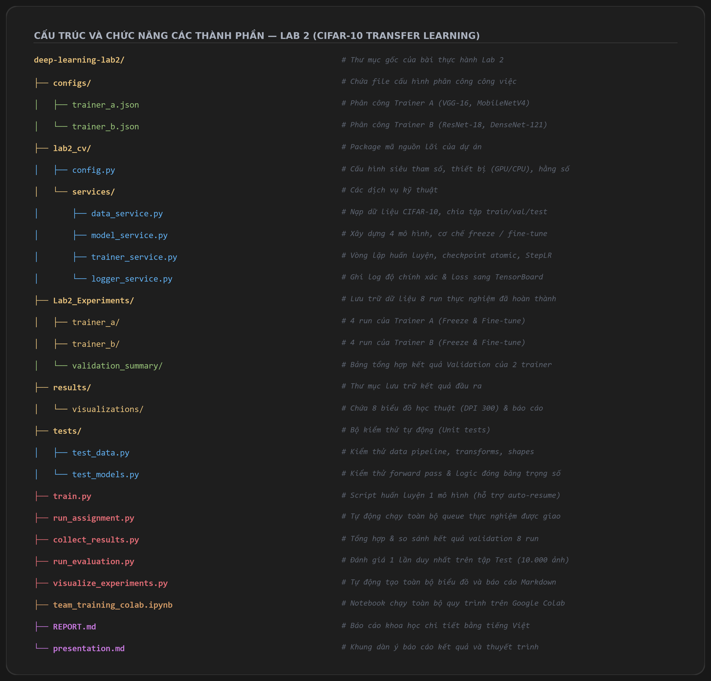
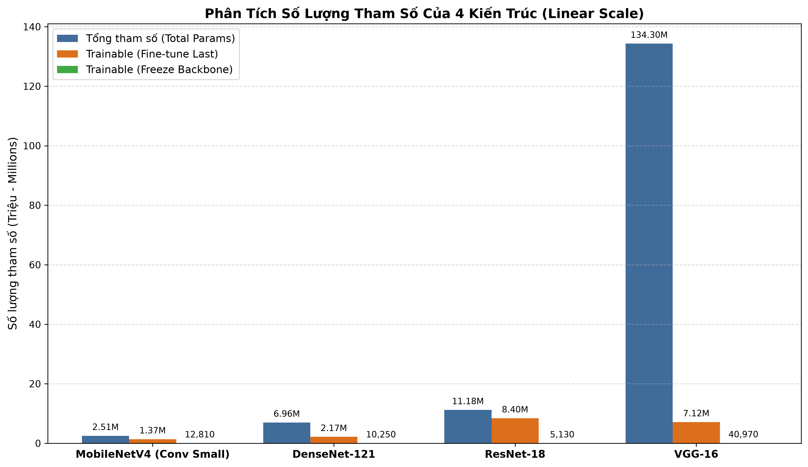
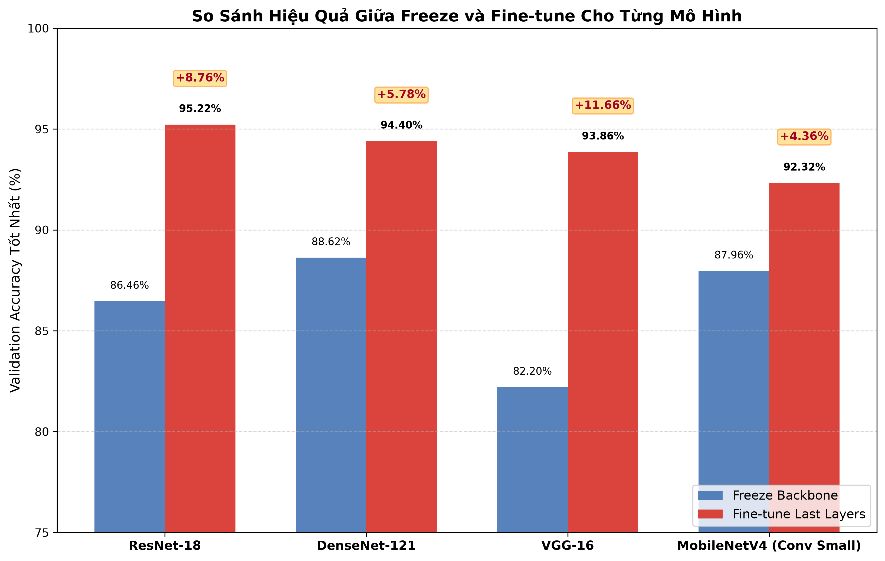
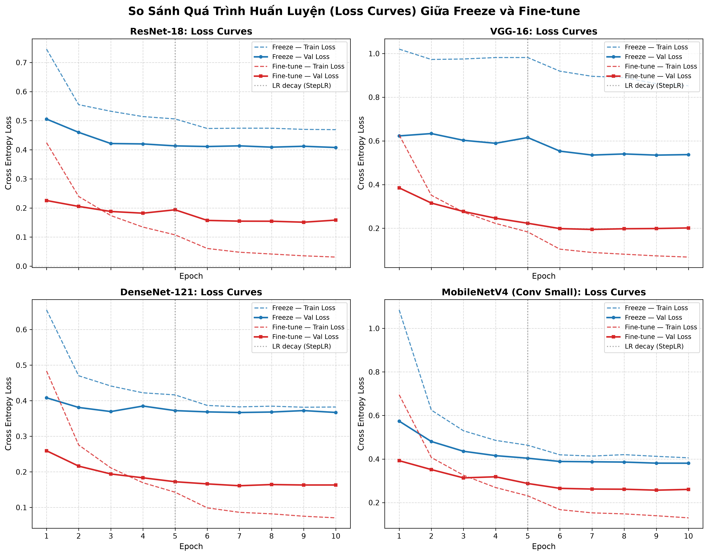
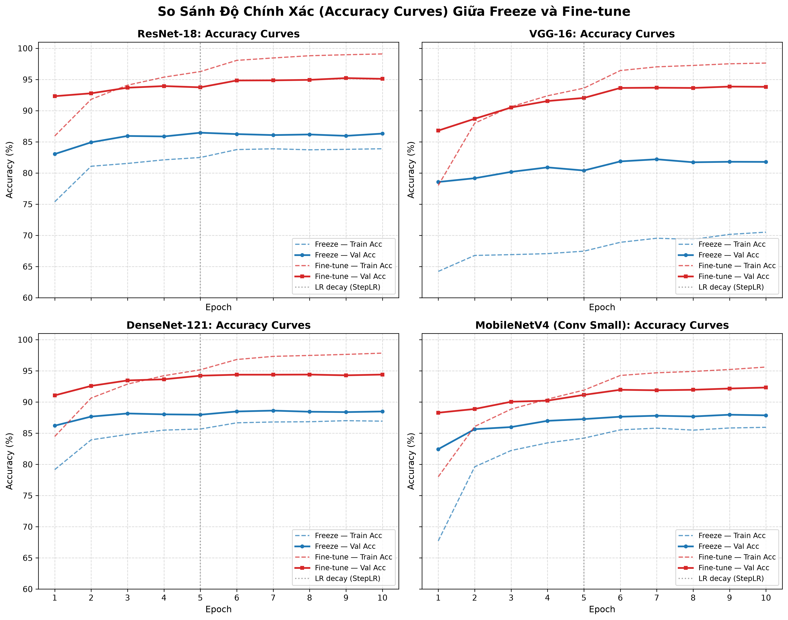
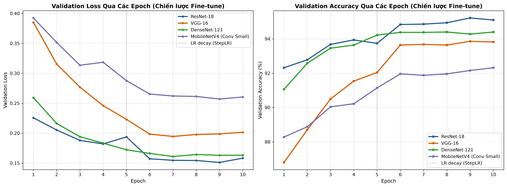
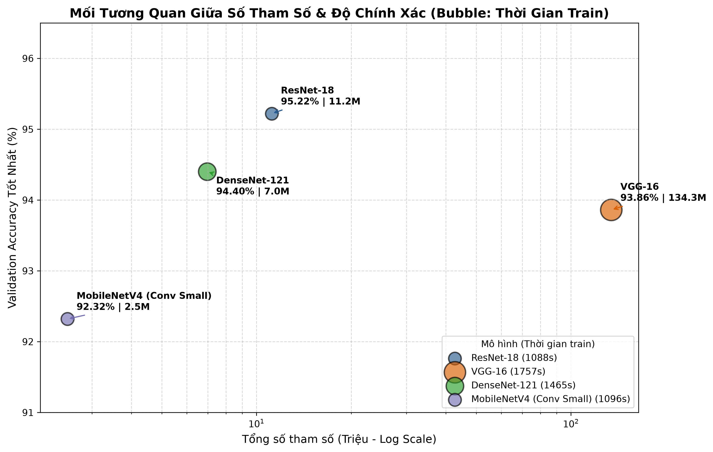
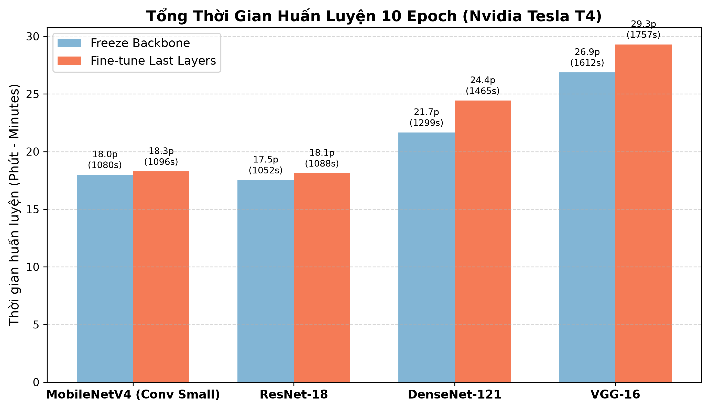

# Báo Cáo Thực Nghiệm Practice 2 — Pre-trained Models on CIFAR-10

**Môn học:** Deep Learning / Thị giác máy tính (Computer Vision)  
**Nhiệm vụ:** So sánh hiệu năng, quy mô tham số và tốc độ của 4 kiến trúc mạng nơ-ron tích chập (ResNet-18, DenseNet-121, VGG-16, MobileNetV4 Conv Small) áp dụng kỹ thuật Transfer Learning trên tập dữ liệu CIFAR-10.

---

## 1. Giới Thiệu & Thiết Kế Thực Nghiệm

### 1.1. Tập dữ liệu CIFAR-10
- **Tổng số ảnh:** 60.000 ảnh màu RGB kích thước $32 \times 32$, gồm 10 lớp cân bằng (mỗi lớp 6.000 ảnh).
- **Phân chia dữ liệu (Data Split) chuẩn hóa giữa các thành viên:**
  - **Train:** 45.000 ảnh (có Data Augmentation: RandomHorizontalFlip $p=0.5$, RandomRotation $\pm 10^\circ$).
  - **Validation:** 5.000 ảnh (không augmentation, dùng để chọn checkpoint `best.pt` và siêu tham số).
  - **Test:** 10.000 ảnh (chỉ dùng đánh giá khách quan cuối cùng).
  - **Seed ngẫu nhiên:** 42 với mã kiểm tra checksum (`validation_indices_checksum = 314146299520`) đảm bảo 100% các thành viên dùng cùng một phân chia dữ liệu.
  - **Tiền xử lý:** Resize ảnh lên $224 \times 224$ và chuẩn hóa theo Mean/Std chuẩn của ImageNet-1K (`[0.485, 0.456, 0.406]`, `[0.229, 0.224, 0.225]`).

### 1.2. Phân công thực nghiệm (Team Assignment)
- **Trainer A:** Huấn luyện **VGG-16** và **MobileNetV4 Conv Small**.
- **Trainer B:** Huấn luyện **ResNet-18** và **DenseNet-121**.
- Mỗi kiến trúc được thử nghiệm dưới 2 chiến lược:
  1. **Freeze Backbone:** Đóng băng toàn bộ trọng số pre-trained, chỉ cập nhật tầng Linear phân loại cuối cùng (Classifier).
  2. **Fine-tune Last Layers:** Mở khóa huấn luyện tầng Classifier và các khối tích chập đặc trưng cuối cùng (Layer 4 của ResNet, Block 5 của VGG, DenseBlock 4 của DenseNet, Conv Head của MobileNetV4).

### 1.3. Cấu trúc tổng thể dự án Lab 2 & Chức năng các thành phần

Hệ thống mã nguồn, phân công thực nghiệm và kết quả được tổ chức theo cấu trúc module hóa chuẩn:

```text
deep-learning-lab2/
├── configs/                          # Cấu hình phân công thí nghiệm cho từng thành viên
│   ├── trainer_a.json                # Phân công Trainer A (VGG-16, MobileNetV4)
│   └── trainer_b.json                # Phân công Trainer B (ResNet-18, DenseNet-121)
├── lab2_cv/                          # Package mã nguồn cốt lõi của dự án
│   ├── config.py                     # Cấu hình siêu tham số, thiết bị (GPU/CPU), hằng số
│   └── services/                     # Các module dịch vụ xử lý nghiệp vụ
│       ├── data_service.py           # Pipeline nạp dữ liệu CIFAR-10, transforms, split train/val/test
│       ├── model_service.py          # Khởi tạo 4 mô hình, quản lý đóng băng (freeze) và fine-tune
│       ├── trainer_service.py        # Vòng lặp huấn luyện, validation, checkpoint atomic, StepLR
│       └── logger_service.py         # Ghi log đồ thị và chỉ số sang TensorBoard
├── Lab2_Experiments/                 # Lưu trữ toàn bộ dữ liệu 8 run thực nghiệm đã hoàn thành
│   ├── trainer_a/                    # 4 run của Trainer A (Freeze & Fine-tune VGG-16, MobileNetV4)
│   ├── trainer_b/                    # 4 run của Trainer B (Freeze & Fine-tune ResNet-18, DenseNet-121)
│   └── validation_summary/           # Bảng kết quả tổng hợp Validation sau khi train
├── results/                          # Thư mục lưu kết quả xuất ra
│   └── visualizations/               # Chứa 8 biểu đồ học thuật (DPI 300) và báo cáo tóm tắt
├── tests/                            # Bộ kiểm thử tự động (Unit tests)
│   ├── test_data.py                  # Kiểm thử tính toàn vẹn của pipeline dữ liệu và transforms
│   └── test_models.py                # Kiểm thử forward pass và logic đóng băng/mở khóa trọng số
├── train.py                          # Script huấn luyện 1 mô hình độc lập (hỗ trợ tự động resume)
├── run_assignment.py                 # Tự động thực thi toàn bộ hàng đợi thí nghiệm được phân công
├── collect_results.py                # Thu thập & so sánh kết quả validation từ 2 trainer
├── run_evaluation.py                 # Đánh giá 1 lần duy nhất trên tập Test (10.000 ảnh) cho 4 model tốt nhất
├── visualize_experiments.py          # Tự động tạo 8 biểu đồ trực quan hóa và báo cáo Markdown
├── team_training_colab.ipynb         # Notebook chạy toàn bộ quy trình trên Google Colab
├── REPORT.md                         # Báo cáo thực nghiệm khoa học chi tiết bằng tiếng Việt
└── presentation.md                   # Khung dàn ý báo cáo kết quả và thuyết trình
```



---

## 2. Phân Tích Kiến Trúc & Quy Mô Tham Số

| Mô hình | Xuất xứ | Tầng phân loại (Head) | Tổng tham số (Total) | Trainable (Freeze) | Trainable (Fine-tune) | Kích thước FP32 (MB) |
|---|---|---|---:|---:|---:|---:|
| **MobileNetV4** | `timm` (`conv_small`) | `get_classifier()` (1280 $\rightarrow$ 10) | **2.505.834** | 12.810 (0.51%) | 1.366.410 (54.53%) | **9.56 MB** |
| **DenseNet-121** | `torchvision` | `classifier` (1024 $\rightarrow$ 10) | **6.964.106** | 10.250 (0.15%) | 2.170.378 (31.17%) | **26.57 MB** |
| **ResNet-18** | `torchvision` | `fc` (512 $\rightarrow$ 10) | **11.181.642** | 5.130 (0.05%) | 8.398.858 (75.11%) | **42.66 MB** |
| **VGG-16** | `torchvision` | `classifier[6]` (4096 $\rightarrow$ 10) | **134.301.514** | 40.970 (0.03%) | 7.120.394 (5.30%) | **512.32 MB** |



> **Nhận xét về tham số:**
> - VGG-16 có số tham số khổng lồ (134.3M), gấp **12 lần** ResNet-18, gấp **19.3 lần** DenseNet-121 và gấp tới **53.6 lần** MobileNetV4. Phần lớn tham số của VGG tập trung ở các lớp Fully Connected đầu tiên của khối phân loại (25088 $\rightarrow$ 4096 $\rightarrow$ 4096).
> - MobileNetV4 Conv Small cực kỳ gọn nhẹ (chỉ 2.5M tham số) nhờ tận dụng Depthwise Separable Convolutions và kiến trúc Universal Inverted Bottleneck (UIB).

---

## 3. Bảng Kết Quả Thực Nghiệm Toàn Diện

Toàn bộ 8 thực nghiệm được huấn luyện trong 10 epoch trên GPU Nvidia Tesla T4 (Google Colab), sử dụng optimizer AdamW (`weight_decay=1e-4`), bộ lập lịch StepLR (`step_size=5, gamma=0.1`):

| Kiến trúc | Chiến lược | Learning Rate | Val Accuracy (Tốt nhất) | Best Epoch | Final Train Loss | Final Val Loss | Thời gian Train |
|---|---|---:|---:|---:|---:|---:|---:|
| **ResNet-18** | **Fine-tune Last** | **1e-4** | **95.22%** | **9** | **0.0264** | **0.1583** | **18.1 phút** |
| ResNet-18 | Freeze Backbone | 1e-3 | 86.46% | 5 | 0.4497 | 0.4078 | 17.5 phút |
| **DenseNet-121** | **Fine-tune Last** | **1e-4** | **94.40%** | **8** | **0.0617** | **0.1631** | **24.4 phút** |
| DenseNet-121 | Freeze Backbone | 1e-3 | 88.62% | 7 | 0.3540 | 0.3669 | 21.7 phút |
| **VGG-16** | **Fine-tune Last** | **1e-4** | **93.86%** | **9** | **0.0705** | **0.2015** | **29.3 phút** |
| VGG-16 | Freeze Backbone | 1e-3 | 82.20% | 7 | 0.8124 | 0.5372 | 26.9 phút |
| **MobileNetV4** | **Fine-tune Last** | **1e-4** | **92.32%** | **10** | **0.1345** | **0.2604** | **18.3 phút** |
| MobileNetV4 | Freeze Backbone | 1e-3 | 87.96% | 9 | 0.4190 | 0.3808 | 18.0 phút |

---

## 4. Hệ Thống Biểu Đồ & Phân Tích Chuyên Sâu

### 4.1. Hiệu quả chuyển đổi giữa Freeze và Fine-tune (Accuracy Gain)



- **Sự vượt trội toàn diện của Fine-tune:** Cả 4 kiến trúc đều ghi nhận mức tăng trưởng độ chính xác rất mạnh khi mở khóa các tầng cuối:
  - **VGG-16:** Tăng trưởng mạnh nhất **+11.66%** (từ 82.20% lên 93.86%).
  - **ResNet-18:** Tăng **+8.76%** (từ 86.46% lên 95.22%).
  - **DenseNet-121:** Tăng **+5.78%** (từ 88.62% lên 94.40%).
  - **MobileNetV4:** Tăng **+4.36%** (từ 87.96% lên 92.32%).
- **Nguyên nhân cốt lõi:** Các đặc trưng cấp thấp (cạnh, góc, texture) của ImageNet được giữ nguyên, nhưng đặc trưng ngữ nghĩa cấp cao ở các tầng cuối cần được điều chỉnh (fine-tune) để tương thích với tỉ lệ vật thể và độ phân giải gốc của ảnh CIFAR-10 ($32 \times 32$ nội suy lên $224 \times 224$).

### 4.2. Quá trình hội tụ Loss qua từng Epoch



- **Tác động của StepLR tại Epoch 5:** 
  - Tại epoch 5, Learning Rate giảm 10 lần (Fine-tune: $10^{-4} \rightarrow 10^{-5}$; Freeze: $10^{-3} \rightarrow 10^{-4}$).
  - Đồ thị ghi nhận một **bước gãy dốc (drop) rõ rệt** của Validation Loss ngay sau epoch 5 ở cả 4 mô hình. Việc giảm bước nhảy giúp optimizer thoát khỏi dao động xung quanh điểm cực tiểu địa phương và rơi sâu vào thung lũng nghiệm tối ưu hơn.
- **Hiện tượng Overfitting:**
  - Ở chiến lược Freeze: Train loss và Val loss bám sát nhau (không overfitting), nhưng giá trị loss dừng lại ở mức khá cao ($0.35 - 0.53$), cho thấy mô hình bị giới hạn năng lực biểu diễn (underfitting).
  - Ở chiến lược Fine-tune: Train loss giảm sâu xuống $0.02 - 0.07$, trong khi Val loss đạt đáy ở $0.15 - 0.20$. Khoảng cách (generalization gap) ổn định ở mức nhỏ, chứng minh kỹ thuật Data Augmentation và Weight Decay đã kiểm soát tốt overfitting.

### 4.3. Diễn biến độ chính xác (Accuracy Curves)



- ResNet-18 đạt độ chính xác trên 90% ngay từ epoch 1 ở chiến lược Fine-tune (92.32%) và liên tục tăng trưởng đều đặn đến đỉnh 95.22% ở epoch 9.
- DenseNet-121 có quỹ đạo hội tụ rất mượt mà, đạt 94.40% ở epoch 8.
- VGG-16 ở chiến lược Freeze khởi đầu rất chậm (train acc epoch 1 chỉ ~54%), chứng tỏ việc giữ nguyên toàn bộ đặc trưng trừ 1 lớp FC cuối trên VGG-16 là không tối ưu. Tuy nhiên khi Fine-tune, VGG-16 nhanh chóng bắt kịp các kiến trúc hiện đại.

### 4.4. So sánh trực tiếp 4 kiến trúc trên cùng hệ trục (Fine-tune Last)



- **Độ dốc hội tụ:** ResNet-18 và DenseNet-121 luôn duy trì đường Validation Loss thấp nhất và Validation Accuracy cao nhất xuyên suốt từ epoch 1 đến epoch 10.
- **Tính ổn định:** Đường cong của ResNet-18 và DenseNet-121 ít bị răng cưa hơn VGG-16, thể hiện sự ổn định vượt trội của cấu trúc kết nối tắt (Skip Connections).

### 4.5. Đánh đổi giữa Quy mô tham số và Độ chính xác (Bubble Chart)



- Trục hoành biểu diễn Tổng số tham số theo thang Logarithmic; trục tung biểu diễn Validation Accuracy (%); kích thước bong bóng biểu diễn Tổng thời gian huấn luyện.
- **Hiệu quả kiến trúc (Architectural Efficiency):**
  - **Quán quân hiệu năng:** **ResNet-18** (Acc cao nhất 95.22%, train nhanh nhất 18.1 phút, tham số vừa phải 11.2M).
  - **Quán quân kinh tế/tối ưu phần cứng:** **MobileNetV4 Conv Small** (Acc 92.32% chỉ kém VGG 1.5%, nhưng kích thước nhẹ hơn **53.6 lần** và thời gian train nhanh hơn 1.6 lần).
  - **Kém hiệu quả nhất:** **VGG-16** (quá nặng nề 134.3M tham số, tốn nhiều thời gian nhất 29.3 phút, nhưng độ chính xác chỉ xếp thứ 3).

### 4.6. Thời gian huấn luyện (Training Time on Tesla T4)



- **MobileNetV4** và **ResNet-18** có thời gian chạy gần như tương đương (~18.0 - 18.3 phút cho 10 epoch).
- **DenseNet-121** (24.4 phút) chậm hơn khoảng 34% so với ResNet-18 do thao tác ghép nối tensor (concatenation) trong Dense Block liên tục yêu cầu cấp phát và sao chép bộ nhớ GPU.
- **VGG-16** (29.3 phút) tốn thời gian nhất do số lượng phép tính MACs lớn ở các tầng tích chập $3 \times 3$ với số kênh sâu (512 channels) và 3 tầng FC khổng lồ.

---

## 5. Hướng Dẫn Tái Tạo Kết Quả (Reproduction Guide)

### 5.1. Tổng hợp kết quả từ các Trainer
```bash
python collect_results.py --experiments-root Lab2_Experiments
```
*Kết quả xuất ra tại `Lab2_Experiments/validation_summary/validation_results.csv`.*

### 5.2. Chạy module trực quan hóa và xuất toàn bộ biểu đồ
```bash
python visualize_experiments.py --experiments-root Lab2_Experiments --output-dir results/visualizations
```
*Tất cả 7 biểu đồ chất lượng cao (DPI 300) và báo cáo tóm tắt sẽ được lưu trong `results/visualizations/`.*

### 5.3. Đánh giá kiểm thử cuối cùng trên tập Test (Khi chạy trên Colab có GPU)
```bash
python run_evaluation.py \
  --experiments-root Lab2_Experiments \
  --output-dir results/final_evaluation \
  --data-dir /content/cifar10_data
```
*Script tự động chọn 4 checkpoint `best.pt` của 4 mô hình (chiến lược `finetune_last`), chạy đánh giá 1 lần duy nhất trên tập Test (10.000 ảnh), vẽ Confusion Matrix cho từng mô hình và tính Macro F1-score.*

---

## 6. Kết Luận

1. Kỹ thuật **Transfer Learning** kết hợp giải phóng khối tích chập cuối (**Fine-tune Last Layers**) mang lại hiệu quả vượt trội so với việc chỉ huấn luyện tầng phân loại (**Freeze Backbone**), giúp độ chính xác cải thiện từ **+4.36%** đến **+11.66%**.
2. **ResNet-18** chứng minh là kiến trúc tối ưu toàn diện nhất cho bài toán này, dẫn đầu cả về độ chính xác (95.22%) lẫn tốc độ hội tụ (18.1 phút).
3. **MobileNetV4 Conv Small** thể hiện tính ứng dụng thực tế cực cao cho các thiết bị di động và biên (edge devices), đạt 92.32% độ chính xác với kích thước vỏn vẹn 9.56 MB.
4. Kiến trúc cổ điển **VGG-16** bộc lộ rõ các nhược điểm về kích thước và chi phí tính toán khi so sánh với các kiến trúc hiện đại có Residual / Dense / Depthwise Separable connections.
